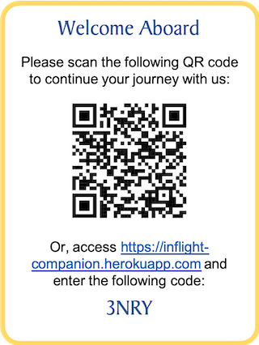

## In-Flight Companion

Presented by No Code No Life team participating in Singapore Airlines AppChallenge 2019.

### Summary

In-Flight Companion is a web app which aims to make in-flight services more accessible to passengers. By simply scanning the QR code, passengers can use their mobile phones to access various services including viewing flight information, making meal orders, browsing KrisWorld and KrisShop, calling for cabin service, and submitting feedback to the aircrew.

### Prototype

A working prototype is available at https://inflight-companion.herokuapp.com. **It is recommended to access using a mobile phone.** You may scan this QR code, or follow the instruction below: 

Before you access the page, please note the following points:
- Due to the limitation of a free server, the app may take about half a minute to load when you access it for the first time in a while. If the page shows error after loading, please refresh the page. 
- If you are accessing using a desktop browser, please use the Device Simulation Mode in Chrome DevTools. You may find how to do it [here](https://developers.google.com/web/tools/chrome-devtools/device-mode/). The display is optimal if you set the device size to iPhone 6/7/8.
- There are some features that are only applicable to this demo: 
    - The language setting is for demo purpose and only applies to the home page.
    - You can change the current flight stage by clicking on the page title of the home page.
    - You can change the dining mode by clicking on the page title of the dining page.
